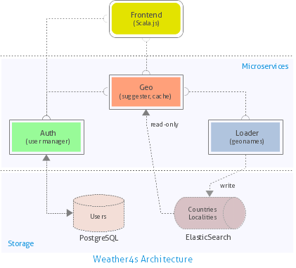

Weather4S  [![Chat][gitter-badge]][gitter-link]
=========



---

[![Cats][cats-badge]][cats-link]

### Objectives

While still aiming to have a project that is of practical use, to some extent, **weather4s**'s usefulness for a hypothetical user is not particularly relevant.
The ultimate goal is rather to implement a fully-fledged, professional-grade, and of course functioning, template/PoC
- for exploring FP concepts in Scala
- as well as a base from which to get ideas and tips for future projects.

The project also pretends to be opinionated, in some way, as it should
- use only libraries that fully embrace the FP philosophy, being the only exception so far **Lucene**, used anyhow just in a few unit tests to assess the behaviour of the
  suggester
- and never make use of any library that could add any sort of "magic" to the codebase (no dependency injection, for instance).

### Microservices

- **Loader**. Operates only upon a user request, sent via **Geo**. An architectural choice was to feed ElasticSearch with localities only when the user expressly asks
  to make a specific country available for weather queries. When this happens and as long as the country's localities are not already present in the engine, the service
  downloads the related CSV file from [geonames](http://download.geonames.org/export/dump/), transforms it and adds all resulting localities to the engine in a new
  "country" engine index.

  Only if the process is successful the **countries** engine index gets updated, with the document of the "new" country set as *available*. **Geo** is notified that one
  country is now available only after **Loader** updates the **meta** engine index, which acts as a trigger (ElasticSearch doesn't provide a "transaction-like" mechanism),
  and anyhow only at the next iteration of the "CacheHandler" in **Geo** which, after noticed the **meta** document was updated, makes the country visible to the user as
  a last step .

- **Geo**. Aside from user authentication, handled by **Auth**, **Geo** is the main backend interface for the frontend to which it provides the list of available and
  non-available-yet countries, as well as the list of suggestions while the user types the name of the locality she is looking the weather info for.

  It is also responsible for the initialization of the engine, in which it persists, at the first launch of Weather4s, the list of all countries in the world, marked as
  *not-available-yet*, as well as the **meta** document (in a specific engine index).

- **Auth** (*In the works now!*). As expected, **Auth** handles all aspects of user management. From registration via email activation to authentication, to the
  management of the profile, used by **Geo** to show the weather of the landing locality, chosen by the user during the registration, every time she logs in.

### Frontend

**TBD** ... in truth, I already have a working prototype, but it's in Typescript/React. I won't use that, then. Plan is to only use FP Scala, accordingly
the last step will be to write the frontend using Scala.js. Still, it should more or less draws on the same ideas, style and functionalities of the former implementation,
as shown in [this screenshot](docs/screenshot.png), with the addition of user login/profile/registration pages.

### Requirements

- JDK 8+
- scala 2.13+
- sbt 1.3+
- docker 19+

### Build

```shell
$ sbt compile docker:publishLocal && docker system prune -f
```

### Tests

```shell
$ sbt test it:test
```
Every microservice can still be independently tested:
```
$ sbt "project auth" ";test; it:test"
$ sbt "project geo" ";test; it:test"
$ sbt "project loader" ";test; it:test"
```

## Running Weather4s

```shell
$ ./bin/start-w4s.sh
```
and
```shell
$ ./bin/stop-w4s.sh
```
to stop the application.

All microservices can also just use http (but it's not recommended), instead of https, by starting Weather4s with:
```shell
$ ./bin/start-w4s-http.sh
```
In that case, it can be stopped running:
```shell
$ ./bin/stop-w4s-http.sh
```

#### Health checks (e.g. with HTTPie)
```shell
$ http --verify no https://0.0.0.0:8442/auth/health
$ http --verify no https://0.0.0.0:8443/geo/health
$ http --verify no https://0.0.0.0:8444/loader/health
```

#### Configuration

All Weather4s' configuration properties can be found in **env-w4s**, **env-w4s-ssl** and **env-w4s-secrets**
under the **bin/** directory.

#### Running a single microservice

```shell
# Auth requires Postgres and env vars in bin/env-w4s-secrets
$ ./bin/run-postgres.sh; sbt "project auth" run
```
or
```shell
$ ./bin/run-elastic.sh;  sbt "project geo" run      # Geo requires ElasticSearch
```
or
```shell
$ ./bin/run-elastic.sh;  sbt "project loader" run   # Loader requires ElasticSearch
```
Any running microservice can then be stopped with *Ctrl-C*, while the Postgres and the ElasticSearch
containers respectively with "`docker stop w4sPostgres`" and "`docker stop w4sElastic`".

## REST Endpoints

**TBD**

[cats-badge]: https://typelevel.org/cats/img/cats-badge-tiny.png
[cats-link]: https://typelevel.org/cats/
[gitter-badge]: https://badges.gitter.im/Join%20Chat.svg
[gitter-link]: https://gitter.im/sherpair/weather4s
